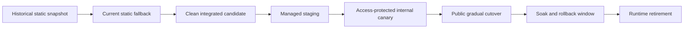

# Research Navigator reconciliation — 2026-09-01

Status: **not release-eligible**. This packet reconciles the clean local
integration candidate, its receipts, the historical production snapshot, the
provider lanes, and the authorization register. It does not approve a
deployment, a remote push, a live request, a migration, a holdout evaluation,
or a public pointer change.

The machine-readable source is
[`research-navigator-reconciliation-2026-09-01.json`](./research-navigator-reconciliation-2026-09-01.json), validated against
[`research-navigator-reconciliation-2026-09-01.schema.json`](./research-navigator-reconciliation-2026-09-01.schema.json).

## Candidate and integration

The candidate branch is `codex/research-navigator-integration`, clean at
`63929b341fa881a01d3b795c26b22faddca6ed8a` with tree
`552351f6c9e61420560b46f67d70c54dbae9a1ac`. The main worktree’s pre-existing
user changes to `RELEASE_PROVENANCE.json` and `.serena/` were kept out of the
candidate and out of all provider payloads.

| Source | Tip | Tree | Integration disposition |
| --- | --- | --- | --- |
| PR #3 handoff | `db6ef95372910e63e3fba5bc8d6e6f58276af9ee` | `121a4928b5c59dff29a3bbe077afdd84708e2cab` | Merged first as the foundation (`a928a77`) |
| PR #4 successor | `01620e9b74580c6720f8d982aee1e39aae127592` | `adab3cc0d7b01d601a890e30eab37ec1a62be0ab` | Merged after PR #3 (`8deaf66`) |
| PR #5 connectors | `69c5e2fb3f71bda7dd0d9b7e7d745922b230f9d8` | `21db2e59bfefe9870ccea0eb46d4914845ab43ed` | Merged after the successor (`b78d0f7`) |
| PR #6 DB attestation | `fd80c303ef8fcca8f5067434361ec3196408267c` | `8af8e2cba04e7274da6a4a80140790e5b124e022` | Parallel slice; execution-ledger conflict resolved in `57e9515` |
| PR #7 DB operations | `d154e7db7bd3628cb45efbe5d12e7ab823880f73` | `f1f9a722668e73d7b330408b49be701f222da9a5` | Merged after DB attestation (`f5fc0d0`) |
| PR #8 CAS hardening | `f00394062e15522ec2cfd80b45a7defc6158d177` | `99880f55f952e60160f31915d80e331abf51f6de` | Four focused ports plus topology merge `49e5658`; not wholesale-merged |

The PR #8 port is intentionally split into `8f3b03f` (fixture durable
serialization), `a993e15` (evidence), `e89a36a` (successor attestation), and
`1ef43ba` (Node 22 CI). The final `49e5658` merge attaches the original PR8
ancestry so the v1.1 verifier’s authorized implementation remains an ancestor
without changing the integrated content. WP4’s local composition boundary is
the focused `63929b3` commit; its defaults remain inert.

## Evidence classification

The inventory uses six non-interchangeable classes:

- `current`: current repository evidence whose stated scope is valid;
- `integrated_candidate`: bytes on the clean integration branch;
- `fixture_only`: synthetic or local-only behavior with no managed claim;
- `historical`: an older production snapshot or receipt retained for context;
- `stale`: a receipt bound to an older candidate and not silently repinned;
- `blocked_external_authorization`: evidence that cannot be produced until the
  relevant register entry and owner decision exist.

The historical `RELEASE_PROVENANCE.json` is a particularly important case. Its
`corpus.manifest_sha256` value is the c157 **content fingerprint**
`adcfb56babc981a4c7dfc787af86d56f5fb2a31e84de02f9db8c93f0548b5d03`; it is not
the SHA-256 of `corpus-manifest.json`. New evidence uses separate names:

| Corpus | Records | Manifest file SHA-256 | Content fingerprint | Algorithm fingerprint |
| --- | ---: | --- | --- | --- |
| c143 historical | 143 | `5622272ded52b0cbf039da47114142f8cb35ba634e8a6bbb9ee55b0ecd70511c` | `0e676ada3d601275083615a3f7804781eef1c183cb1b7efcf7ec8044fce33b3d` | `0316cf544da21a5b6790d91c126fa1d348c080b77fcbf5225d81cbe09bebefa2` |
| c157 current seed | 157 | `23f704ce3e421a6eb26c2b3677d616a1ae6b4f45226233257b9a1ff676caba2b` | `adcfb56babc981a4c7dfc787af86d56f5fb2a31e84de02f9db8c93f0548b5d03` | `b17c49fcd3f5fd1a09c38902f8733437e366b75f1e764a92cadf3f9788116ae6` |

The bridge is therefore reproducible as an artifact-generation result, while
its release state remains `FAIL_PRE_TUNING`. The four lanes do not constitute a
consolidated v2 ranking implementation.

## Status planes

| Plane | State | Meaning |
| --- | --- | --- |
| Local implementation | Partially complete | PR integration, local control-plane seams, contract tests, and static/fixture receipts are present. WP8 post-freeze tuning and the final exact-candidate gate remain open. |
| External verification | Blocked | Managed provider catalogs, live egress, recovery/load/soak, the protected holdout, and human evidence have not been performed. |
| Public activation | Blocked | Candidate routers and public flags remain disabled or unwired; no public pointer or production traffic changed. |

The release gate is not a boolean inferred from local test success. Local,
fixture, managed, staging, canary, and production evidence stay separate.

## Dependency graph

The first edge is already available as historical/static compatibility. The
candidate edge is held by the WP8 quality state and the one exact release-gate
run. Candidate-to-staging requires `AUTH-01`, `AUTH-02`, `AUTH-03`, and
`AUTH-11`; subsequent edges require the specific recovery, canary, human,
holdout, cutover, soak, and retirement entries recorded in the JSON blocker
list.

## Work-package disposition

| Work package | Local state | Still required |
| --- | --- | --- |
| WP3 | Static infrastructure and least-privilege evidence pass | Managed catalog, provider binding, migration, recovery, and role evidence |
| WP4 | Local control plane and disabled composition markers pass | Authorized Cloudflare Queue/Workflow/Cron/DLQ composition and managed fault injection |
| WP5 | Fixture transport and payload safety pass | Real socket pinning, live metadata-only canary, managed capture evidence |
| WP6 | Local PostgreSQL migration validation pass | Managed application through 0007 and isolated rollback |
| WP7 | Contract and synthetic benchmark shape pass | Independent identity adjudication and reversal evidence |
| WP8 | Projection scaffolding pass; quality `FAIL_PRE_TUNING` | Development/validation tuning, production-shaped plans, and `AUTH-13` final holdout |
| WP9 | Technical coverage implementation pass | Product-owner wording decision and production corpus evidence |
| WP10A | Technical freeze pass | Owner ratification (`AUTH-12`) |
| WP10B | Not started by design | Authorized deterministic planner and PA safety fixture |
| WP11 | Candidate UI/API implementation, human evidence pending | Usability study, expert review, and activation approval |
| WP12 | Fixture-only, unwired toolkit pass | Capability parity and authorized canary gates |
| WP13 | Fixture-only, unwired SEO pass | Exact production corpus, crawler/sitemap canaries, and public activation |
| WP14 | Fixture CAS successor and state-machine tests pass | One exact final gate, managed canary/recovery/load/soak, promotion, and retirement |

## Co-Engineer lanes

The historical bounded Cursor-local CAS and connector slices were reviewed and
their applicable code was integrated through the PR lines above. The fresh
Cursor aggregate submission `ushso-cursor-wave-0901` contained six disjoint
implementation/fix lanes and two read-only review lanes, all against the exact
candidate base. Its required `decision_or_attention` wait returned all eight
lanes `dispatch_failed`; there were no child worktrees, commits, artifacts, or
remote mutations.

The fresh Grok attempts were not dispatched. A selected-path mirror and then a
two-file CAS mirror were rejected by payload safety before provider work because
the code was classified as non-public organizational data. No files were sent
to Grok and no workaround was attempted. Historical Grok receipts remain
review input, not approval or independent release evidence.

## Local verification

The writable isolated clone passed the local contract sweep, including WP4,
ingestion, WP6 (14 tests with local PostgreSQL), WP8 (35 tests), WP10A, WP11,
WP12, WP13, WP14, program verification, external-authorization validation, and
CI verification. The WP14 v1.1 verifier passed 24/24 checks and remains bound to
`f2641a3`; it does not attest the later integration tree. WP8’s 35 passing tests
are scaffolding tests; the quality receipt remains `FAIL_PRE_TUNING`.

The final gate must run once against the eventual exact clean candidate and
capture its own commit, tree, artifact manifest, environment, and result. The
older failed run `20260831T170024Z-3003695ba806` remains historical because it
predates this candidate. A focused test or a successful historical CI run cannot
be relabeled as that final gate.

## Authorization and no-claim boundary

`verification/external-authorization/v1.0.0/register.json` is authoritative;
`AUTH-01` through `AUTH-17` remain `status: not_requested` and
`authorized: false`. In particular:

- `AUTH-01..09` and `AUTH-11` block paid resources, secrets, provider changes,
  managed migrations, live/canary traffic, recovery, soak, and retirement;
- `AUTH-10` blocks remote push/PR handoff in this run;
- `AUTH-12` blocks WP10B planner implementation and activation;
- `AUTH-13` blocks a fresh final retrieval holdout;
- `AUTH-14..17` block identity, coverage wording, usability, and expert-review
  claims.

Accordingly this packet claims none of the following: production deployment or
eligibility, public cutover, live source requests, managed provider mutation,
secret creation, migration application, canary, soak, backup/restore, load
test, human adjudication, protected-holdout score, or PR creation. A future
authorization must bind the exact candidate, scope, expiry, stop conditions,
rollback plan, and resulting execution receipt.

## Next controlled actions

1. Complete or explicitly disposition development/validation-only WP8 tuning
   without reading or scoring the protected final holdout.
2. Freeze the final local candidate and run the exact release gate once.
3. With owner authorization, perform only the appropriate managed or human
   packet, retaining a separate receipt for each external state transition.
4. Reconcile final PR/remote handoff only after the local release gate and
   scoped review inventory are complete; never convert this packet into an
   authorization record.
