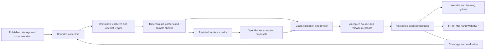

# USHSO master plan: from catalog to research navigator

Prepared September 10, 2026. This package is a proposed implementation program grounded in [the fresh product/data audit](../../reviews/2026-09-10-product-data-audit/REPORT.md). It specifies work and acceptance; it does not claim that the work is already implemented. Existing production remains unchanged.

## Mission and the finished experience

**Help humans and AI find the right US health-systems data, understand what it can and cannot answer, and obtain a tested route to use it.**

USHSO should be a research reference desk with executable directions. Each source page answers: What is this? Who and what does it cover? What does one observation represent? Which release and fields do I need? What are the access conditions? What did USHSO actually test? How can I combine it with another source? How do I cite and reproduce this decision?

A junior researcher investigating hospital finances in Pennsylvania should finish a guided route that identifies HCRIS and PHC4, explains their different reporting scopes, shows actual field names and a bounded example, distinguishes financial statements from patient-level claims, and exports a source packet. An experienced researcher should reach exact releases, row-grain definitions, codebooks, suppression and revision notes, and qualified linkage evidence without reading introductory material. An agent should obtain the same facts through MCP, WebMCP, and documented HTTP contracts.

The product includes **hospital price-transparency and insurer Transparency in Coverage MRFs** in this program. It identifies files, formats, releases, facilities/plans, relevant fields, tested samples, and limitations. A negotiated rate is not an observed utilization-weighted payment, and a hospital's published charge is not a patient's expected bill. Those distinctions belong in the data model and research guide, not only a footer.

## Starting point: preserve and complete the useful work

The live catalog contains 3,434 records from CMS, CDC, and Census; 3,430 are searchable. All canonical retrieval interfaces and geographic coverage fields are unknown, none of the recipes is machine actionable, and no joins are published. The retained release includes 2,905 proposed dictionaries with 1,573,847 record-scoped entries; all have unresolved schema applicability. The eight machine tools execute, but several return unknown because the source information they need has not been published.

Reuse the current release's `scripts/research/` collectors, PDF/layout parsers, update-cycle and dictionary composition tools; `packages/ingestion`, `packages/connectors`, `packages/normalization`, `packages/identity`, `packages/registry`, and `packages/search`; the machine-toolkit contracts and clients; and the public React components. Inspect their actual completion state against the accepted release before assigning work. A file or passing fixture is not an operating service.

The active checkout and cached remote are stale relative to production. PR-001 establishes the correct integration base and preserves existing edits. The old `docs/semp/` candidate model remains historical planning material; its generated files are not edited. PR-001 creates a stable-ID crosswalk between applicable old work packages/ADRs and this execution model so no necessary migration, data-boundary, or release control disappears.

The earlier architecture selects PostgreSQL, immutable publication, and Cloudflare, but also assumes a costly managed database class and prohibits source payloads in the evidence bucket. Those are explicit decisions to reconcile in PR-009. The recommendation is to reuse PostgreSQL interfaces for durable jobs and accepted metadata while retaining the static public release until a measured transition is justified. Do not procure an always-on premium database or change the public runtime merely to run extraction batches. A bounded sample/preview policy must be approved as an explicit architecture successor before any new retained payload storage is introduced.

## Acceptance requirements

These are proposed measurable product targets, not claims about present coverage. The denominator manifests are versioned before implementation tuning. Changes require a reason and a before/after report; removing a difficult case does not improve performance.

| ID | Required outcome | Completion test |
|---|---|---|
| R01 | Every catalog record is accounted for | All 3,434 baseline IDs have a disposition; no silent loss. Each selected source run reconciles enumerated, accepted, unchanged, failed, restricted, and unresolved counts |
| R02 | Evidence labels are accurate | Every public factual field has its source/revision and evidence state; inferred tags never become observed grain; freshness advances with the actual evaluation time |
| R03 | Every record has a test disposition | 100% have an eligibility decision and latest attempt or specific stop reason for metadata, documentation, API/file sample, and schema binding; `not_attempted` is not success |
| R04 | Core research sources are usable | A frozen **100-product priority cohort** has complete mandatory source cards. At least 80 publicly accessible products have a recent successful bounded sample and exact technical recipe; remaining cohort members have verified restricted/manual access routes. Record versions are not extra products |
| R05 | Variables mean something | For every selected priority release, 100% of fields used in its example are bound to exact wire names, documented meaning, type state, unit or reasoned not-applicable state, allowed values/missingness where relevant, and provenance. Unknown optional fields stay visible |
| R06 | Broader extraction improves materially | At least 95% of baseline records with publisher-accessible dictionaries yield a qualified parsed dictionary; the eligible denominator is explicitly evidenced. All other baseline records retain a reason and next action. This does not imply 95% of all fields have documented definitions |
| R07 | Research retrieval is measured | Current-generation, frozen present-source recall@10 ≥0.90; judged precision@5 ≥0.80; zero critical forbidden matches; separately report full-universe recall and source absence. Publish task-level failures and reviewer uncertainty |
| R08 | Linkage is evidence-based | At least 15 priority join routes, spanning facility and geographic linkage, have source/release/key context, cardinality checks, matched/unmatched denominators, temporal constraints, and limitations. Unsupported CCN=NPI and name-only equality are rejected |
| R09 | Major coverage gaps are addressed | Add the twelve named source families below with supported identities/access routes and explicit data scope. A restricted source is useful as a verified route, without pretending to have its payload |
| R10 | MRFs are a real product layer | Pilot directory covers 25 hospitals and 10 payer reporting entities from a frozen selection; every item has an evidence-backed locator/disposition. At least 20 hospital and eight payer entries have a successfully parsed bounded sample; no substitution of enforcement datasets for rate files |
| R11 | Machine and human outputs agree | All eight existing tools have positive and honest negative cases. For each priority example, IDs, release/schema context, field meanings, access state and citations agree across HTTP, MCP, WebMCP, and UI |
| R12 | Beginners and experts can finish tasks | Eight novice and eight advanced moderated participants, distinct from implementers, attempt a frozen set of tasks; ≥85% completion in each group, no critical misinterpretation of access/grain/price semantics. Synthetic agent runs are separate evidence |
| R13 | Documentation is usable | Beginner start, researcher workflow, developer/MCP setup, access, variables, joins, MRFs, uncertainty, citations, methodology, coverage, About and corrections guides exist, are cross-linked, and use tested examples |
| R14 | AI enrichment is controlled and economical | No model in public request handling; no private data/credentials sent in enrichment; auditable token/spend ledger; 100% accepted model-derived claims pass citation and schema checks; held-out claim precision ≥0.98, with zero critical scientific errors |
| R15 | Refresh is sustainable | Two complete scheduled cycles and a 14-day observation window show bounded queues/spend/storage, timely refresh or explicit stale state, and no silent source loss. Alerts identify changed/actionable states, not routine success spam |
| R16 | The final release is independently qualified | Reproducible locked build, appropriate tests, current benchmark, actual browser/client journeys, capacity check, stage-to-production artifact identity, rollback rehearsal and post-deploy checks pass on the reviewed candidate |

“Complete mandatory source card” means actual values or a justified not-applicable field, not a grid filled with unknown. For a restricted product, the access workflow and documented contents can satisfy the route requirements; successful restricted payload retrieval is not implied. A product with an unresolved essential research field remains incomplete. If fewer than 80 products can meet the public-sample target, report the shortfall and improve the pipeline; do not quietly redefine the cohort.

### Initial source expansion set

The twelve families are: PHC4 hospital financial/utilization reports; AHRQ HCUP; AHRQ MEPS; HRSA Area Health Resources Files; NPPES; SAMHSA facility services data; CMS T-MSIS/TAF; AHA Annual Survey; state APCD programs; state facility licensure; rural hospital closure tracking; and CDC/ATSDR Social Vulnerability Index as an exact source family. Each gets its own lineage, geography and access status. Existing representations are reconciled before new records are created. Publisher source terms and identities are verified during intake; a familiar acronym is not enough.

The 100-product cohort is established in PR-002 from these named priorities and existing CMS/CDC/Census products. It must span finance, ownership, quality, utilization, workforce, insurance, population, geography, public health, and prices; include both beginner and advanced tasks; and separate product families from annual releases. Its exact record/source-native IDs are an implementation input reviewed before collection begins. It is deliberately not chosen by whichever records are easiest to enrich.

## Data model and verification architecture

**Control plane:** durable jobs, per-source leases, retry schedule, outbox and an evidence ledger. Reuse existing PostgreSQL abstractions and test locally first. Compute collectors outside the public request path. The scheduler/harvest Worker composition roots currently being disabled is a named activation task, not a reason to bypass them with a public crawl endpoint.

**Evidence:** capture URL, requested parameters without secrets, final public locator, timestamp, status, MIME, encoding, byte/hash identity, parser version, distribution/release binding and exact pointer/page/table coordinates. Retain source-native labels and separately store exact wire keys. A record, distribution, endpoint, schema, and documentation resource are distinct entities.

**Verification axes:** catalog membership, documented access, executed access, schema documentation, observed sample shape, release binding, grain, geography, temporal scope, licensing/cost, scientific interpretation, and linkage are separate. Each has value, evidence, last attempt, last successful observation, next review date, and status. A successful observation in one axis does not upgrade another.

**States:** retain existing typed outcomes and introduce versioned distinctions as needed: not attempted, documented, observed, validated, restricted/authentication required, unavailable, parse failed, stale, unresolved, conflicting, not applicable. Status names must not collapse operational success, scientific confidence, and permission into one score. HTTP 200 HTML is a content mismatch or access gate when JSON was expected. A schema passing syntax checks is not proof of full dataset completeness.

**Bounded samples:** API adapters request a few aggregate/public rows or a specific documented small response. File adapters honor size and expansion limits; a partial byte prefix does not validate an entire JSON/GZIP file. Sample receipts explicitly name which checks were possible and which were not. Full MRF acquisition is a separately budgeted operation. No automatic traversal of authentication, agreement, or payment boundaries.

**Publication:** accepted claims create a new immutable generation; a failed or partial source run cannot erase the last good claims or promote proposals. The public bundle, search projection, dictionary pages, machine schemas, guides, and coverage statistics refer to the same generation map. Release/schema identifiers are obtained from publisher evidence or versioned local identity rules, never invented to make a machine call pass.

**Research semantics:** observation grain differs from sampled entity, reporting organization, denominator population, and geographic aggregation. Dates distinguish collection/observation period, fiscal year, release, revision, and projection horizon. Variable semantics distinguish name, label, definition, units, coding, suppression, missingness, measures/identifiers, weights and denominators. Joins additionally need universe/time compatibility, cardinality, loss, and the evidence scope of every mapping.

## Deterministic first, OpenRouter for residual work

The program should first parse CMS catalog/resources metadata, CDC Socrata columns, Census variables/geography/groups, DCAT/CKAN where actually present, OpenAPI where publishers supply it, CSV headers, JSON keys, XLSX tables, and structured PDF text/layout. Cache exact documentation captures and parser outputs by hash. A changed parser can reprocess retained evidence without re-fetching a publisher. Prefer the publisher's existing dictionary to generating one.

The live pilot already returned a 117-column CMS sample and a 154-column CDC sample without a model. The CMS sample revealed 11 dictionary-to-wire name differences. This is direct evidence for a programmatic schema reconciliation stage. The Census 200/HTML missing-key response is an explicit negative fixture.

Only residual jobs reach a model: interpreting a captured prose description, locating a definition in an awkward table, proposing a codebook explanation, identifying a potential source-family relation, or drafting a source card from already bound facts. Inputs contain a bounded public passage and an extraction schema; outputs cite exact passage IDs and can abstain. Models do not issue source requests, run downloaded code, determine authorization, invent absent metadata, or publish their own output.

### Model selection and cost

The September 10 public model-catalog capture confirms:

| Exact model ID | Input / million tokens | Output / million tokens | Relevant constraint |
|---|---:|---:|---|
| `deepseek/deepseek-v4.1-flash` | $0.15 base; listed time windows reach $0.30 | $0.60 base; listed time windows reach $1.20 | Snapshot prices include time-dependent overrides; pin endpoint capabilities and maximum accepted price |
| `meta/muse-spark-1.3-contributor` | $0.10 | $0.20 | Contributor prompts/outputs may be used to improve Meta products |

Both catalog entries advertise structured outputs. Endpoint support and enforcement must still be checked, and returned JSON must be locally validated. Sources: [captured model catalog](https://openrouter.ai/api/v1/models), [Muse Contributor terms/pricing](https://openrouter.ai/meta/muse-spark-1.3-contributor), [structured-output behavior](https://openrouter.ai/docs/guides/features/structured-outputs).

Neither selected model is free. Free models may be useful for development, but quotas and availability make them a poor foundation for a scheduled production queue. The free router also changes the selected model, complicating reproducibility. Use exact IDs and an allowlisted ordered fallback with a stored model/endpoint/price snapshot; do not silently switch to an unevaluated model. [OpenRouter limits](https://openrouter.ai/docs/api/reference/limits), [free router](https://openrouter.ai/openrouter/free).

The model is selected by **cost per accepted correct claim**, not cost per token or agreement between two models. Run both on the same frozen residual tasks, retain raw outputs and abstentions, and compare precision, critical errors, useful coverage, latency, total tokens and review effort. Model-generated labels cannot serve as their own gold set. Disagreements route to an adjudication queue.

Illustrative economics, not a quote or spending authorization:

`calls = records × residual fraction × chunks per record × attempts per chunk`

`inference cost = calls × (input tokens × input unit price + output tokens × output unit price)`

For 3,434 records, 20% residual work, two chunks each, 8,000 input/1,000 output tokens per chunk and 1.2 attempts, the expected 1,648.32 calls cost about **$1.65 Muse**, **$2.97 DeepSeek at base rates**, or **$5.93 at the listed higher rates**. The analogous full-corpus pass is about $8.24/$14.83/$29.67. Fractional calls are expected-value arithmetic; actual batch reservations use whole calls and ceiling budgets.

Those estimates exclude additional reasoning tokens, provider/account fees, OCR, storage, source/API fees, egress, repeated monthly cycles and human review. They are not estimates for processing every row of thousands of MRF files. Tokenize the actual pilot before committing a budget. Start with a proposed $10 pilot cap, then a proposed $50 monthly enrichment cap; the implementation remains disabled for paid traffic until the owner selects the budget and credentials. Hard stops, atomic reservations, UTC reset rules and retained provider usage prevent parallel jobs from exceeding the selected cap. Contributor routing receives only approved public documentation; private questions, PHI, credentials, proprietary documents and restricted records are outside this path. [Provider controls](https://openrouter.ai/docs/guides/routing/provider-selection), [data collection](https://openrouter.ai/docs/guides/privacy/data-collection).

## Phases and how they lead to the goal

The [PR index](PR-INDEX.md) and [machine-readable work model](plan.json) give each phase three or four sub-phases and each sub-phase three bounded PRs. The [execution protocol](EXECUTION.md) applies to every assignment. Each PR file supplies three atomic commits with file scope, instructions, checks, dependency IDs, and required evidence. The [decomposition review](LOGIC-REVIEW.md) checks all 28 sub-phase contracts and their contribution to the overall goal. [Technical references](TECHNICAL-REFERENCES.md) provide verified publisher contracts and implementation starting points.

| Phase | Outcome | Sub-phases | PRs | Exit gate |
|---|---|---|---|---|
| P1 — Establish source truth | One known implementation base, measurable coverage, honest field/identity contracts | 1A Baseline/acceptance; 1B Truth repairs; 1C Versioned source model | 001–009 | No stale-clock or inferred-as-source assertion; every baseline ID accounted for; model and evidence-storage rules agreed |
| P2 — Programmatic evidence | Bounded collectors and tests cover the existing catalog | 2A Durable collection; 2B Source adapters; 2C Documents and keys; 2D Samples and full inventory | 010–021 | Every baseline record has an attempt/stop disposition; public samples and dictionaries reconcile to exact source contexts |
| P3 — Residual AI and publication | Cheap extraction proposals become reviewed, reproducible facts | 3A Provider/cost controls; 3B Extraction/evaluation; 3C Review/publication | 022–030 | Model acceptance quality and budget tests pass; published generation changes are complete and reversible |
| P4 — Research usefulness | Variables, source cards, joins and retrieval answer real research questions | 4A Scientific semantics; 4B Linkage; 4C Retrieval; 4D Priority-cohort workflows | 031–042 | Scientific/retrieval work enables P5; full 100-product qualification consumes P5 intake before closing R04–R08 |
| P5 — Coverage and MRFs | Named missing sources plus useful hospital/payer price-file discovery | 5A Missing sources; 5B Hospital MRFs; 5C Payer MRFs; 5D Pricing validation/product | 043–054 | Named-source and MRF cohort coverage reconciles; source-specific samples and price caveats are usable |
| P6 — Machine product | Agents can inspect the same usable data as humans | 6A Source/dictionary APIs; 6B Client contracts; 6C Research packet and machine qualification | 055–063 | Every enabled tool has a real positive path, typed limitations, version agreement and reproducible client evidence |
| P7 — Human product | Beginner learning, expert tools, clear source pages and final visual polish | 7A Navigation/detail; 7B Research workflow; 7C Guides/accountability; 7D Frontend qualification | 064–075 | Both audience cohorts finish tasks; documentation examples execute; accessibility and browser checks pass |
| P8 — Operate and qualify | A maintainable, measured product is ready to release and stays honest | 8A Refresh/capacity; 8B Independent acceptance; 8C Release and sustained observation | 076–084 | R01–R16 satisfied, production artifact independently reviewed, rollback proven, post-release observation completed |

**Logical sufficiency:** P1 defines identities, states and objective tests. P2 produces observations those contracts can consume. P3 resolves residual documentation work and safely publishes accepted facts. P4 converts those facts into scientific meaning, linkage and measured retrieval. P5 extends the same mechanisms to gaps and MRFs. P6 and P7 expose the same evidence to machines and humans. P8 verifies that those completed workflows operate reliably. Skipping any phase leaves at least one acceptance requirement without a witness.

This is a dependency graph, not eight mandatory serial queues. Documentation structure can start after P1; machine adapters can start once their contracts settle; hospital and payer parsers can run in parallel after common collection boundaries; Astra's final visual work follows stable data/API contracts. In particular, P4's scientific modeling and retrieval work enable P5, while PR-042's final core-cohort qualification waits for PR-043–045 and PR-054 because those added products belong to the cohort. The PR dependencies, not phase numbers alone, control readiness. Phase closure requires all its PRs and the preceding evidence it consumes.

## Formal completeness checks and their limits

Let `G=(V,E)` contain PR nodes and prerequisite edges. Each commit has exactly one PR parent; each PR one sub-phase; each sub-phase one phase. The validator checks unique IDs, existing references, acyclicity, nonempty verifiable outputs, requirement/finding coverage, phase/sub-phase ownership, and a path from every PR to the final acceptance node. The terminal gate depends transitively on all PRs. A failed prerequisite cannot be treated as satisfied by model agreement.

For each source run, require a disjoint partition:

`selected = succeeded + unchanged + failed + restricted + unavailable + unresolved + not_attempted`

For each field axis: `applicable = supported + missing + conflicting`; separately record unknown applicability and not-applicable decisions. Do not mix those with support. `attempt coverage = attempted / eligible`; `usable coverage = usable / required`; `dictionary extraction yield = parsed / publisher-accessible dictionary records`. Every ratio includes its cohort/generation, timestamp and exclusions. Reporting 100% dispositions does not satisfy an 80-product working-sample target.

The verifier establishes structural completeness, arithmetic consistency and synchronization of this plan. It cannot mathematically prove that an unbuilt parser works, that a publisher remains reachable, that humans understand the site, or that 84 PRs will resolve every as-yet-unseen source exception. Those are empirical gates. When a source-specific exception needs more work, add a bounded child PR with the same commit/evidence template, update dependencies and rerun validation. Never call the program complete while an acceptance deficit remains.

## Principal risks and responses

| Risk | Trigger | Response and verification |
|---|---|---|
| Unknown-filled records pass as complete | UI cells all render but essential values remain unresolved | Readiness gates count supported applicable fields and successful tasks, never DOM presence |
| Scientific meanings inferred from names | A field label is treated as a denominator/unit/grain | Literal evidence checks plus expert adjudication for high-impact semantics; retain missing state |
| Cheap model creates expensive review backlog | Low precision, high disagreement or recurring parser errors | Stop that task class; repair deterministic parsing; compare cost per accepted claim including review time |
| Source changes or access gating | MIME/shape/key/release changes; 401/403/200-HTML | Preserve previous observations with stale/blocked state; retry only documented transient cases |
| Huge MRFs dominate storage and jobs | File size/decompression/reference fan-out exceeds budget | Separate manifest discovery, bounded sample and full validation; resume by stable identity and hash, report partial checks |
| Release asset count/latency grows | Dictionary shards approach delivery limits or inflate cold loads | Content-addressed metadata objects and bounded indexed reads; measured plan before topology change |
| Parallel agents conflict or overclaim | Shared-file edits, stale base, missing receipts, fabricated test claims | One task/worktree/branch, file ownership and dependency pins; Astra independently reruns decisive checks |
| Review becomes an unbounded manual bottleneck | Every literal field waits for owner approval | Policy-based promotion of validated literal metadata; human review for scientific/identity/licensing conflicts and sampled quality |
| Existing gates block unrelated progress | Obsolete approval hashes or historical candidate requirements | Reconcile exact subjects and actual authority once; continue independent implementation; never regenerate approval as a test workaround |

## How to execute this package

Start at PR-001 and PR-002; assign only nodes whose prerequisites are merged. Use Luna Max, Grok and DeepSeek as implementers according to the user's selection. Each assignment receives its PR file, the common execution protocol, exact base SHA, permitted files, fixture IDs and a bounded acceptance task. Do not send the full production checkout or environment files to an external provider.

Astra is responsible for integration review, independent verification, scientific-consistency review of evidence, and final frontend work. Domain questions requiring a human research/editorial decision are recorded with an exact proposed value and cited source; they are not hidden behind a successful model response. The owner approves real spending, operational changes and final publication as required by the existing repository/host boundaries. This planning task has created no implementation PRs, deployment, recurring service or paid inference job.

Run `python3 docs/master-plan/2026-09-10/validate.py` to validate the plan's graph, hierarchy, traceability, and generated PR files. See [verification status](VALIDATION.md) for the actual result from this task.

## Bounded CI remediation added during execution

PR-085 adds three commits under P1/1A after CI run 34541539731 exposed a stale WP0 approval subject. The initial 84 PRs and 252 planned commits are retained; the current model contains 85 PRs and 255 planned commits across the same eight phases and 28 sub-phases. Initial sub-phase membership remains intact, with PR-085 explicitly added to 1A. PR-082 also depends on PR-085.

The correction must preserve immutable historical approval, run the current technical checks with fresh code/hash identities, and leave current-subject successor approval separate from development CI. It does not lower R01–R16 thresholds, change frozen cohorts, grant scientific approval, or authorize production. See the PR-085 packet and the evidence-backed exception record in docs/research-program/exceptions/PR-085-ci-attestation.md.
